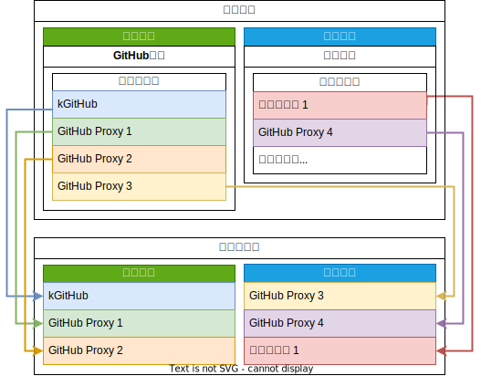

# 使用文档

## 转换链接

软件内仅内置了 GitHub 平台，您可以直接使用 GitHub 链接转换的功能。

1. 选择 GitHub 平台。（因为软件内只有 GitHub 平台，所以不会显示标签栏，但是默认选中的是该平台。）
2. 将 GitHub 文件链接（比如发行版）填入输入框内。
   - 可以复制 GitHub 链接，然后粘贴进输入框。
   - 也可以直接从 GitHub APP 分享链接到此应用。搭配 F-Droid 应用商店使用效果更佳。
   - 需要注意的是，高版本安卓拥有 url 校验，目前可能无法在高版本安卓使用打开浏览器的方式打开此软件。
3. 选择您喜欢的一个转换器。
4. 加工链接（转换链接）。
   - 点击“开始转换”，然后您可以复制链接到浏览器，或者分享给朋友。
   - 或者点击“转换并打开”，使用浏览器打开链接。
   - 或者点击“转换并分享”，将链接分享给好友。

> **TIP**\
> 输入框内文字会自动匹配出链接，因此无须担心链接外拥有杂质的问题。

> **Note**\
> 部分转换器可能会失效，您可能需要随时检查更新，或者更新转换器清单。

## 自定义平台



软件内默认内置 GitHub 平台。如果您还需要转换其他平台的链接（如：GitLab），您可以添加自定义的平台。

1. 下载文件编辑器，或者带有编辑功能的文件管理器。（如：[质感文件](https://github.com/zhanghai/MaterialFiles/releases/latest)、[MT 管理器](https://mt2.cn/)）。
2. 进入软件，点击 `菜单 > 设置... > 编辑平台配置` 。
3. 选择刚刚安装的文件管理或者编辑器，编辑文件内容。

文件大致内容：

``` json
[
    {
        "name": "GitHub",
        "key": "github",
        "categories": [
            [
                "kGitHub",
                "kgithub"
            ],
            [
                "GitHub 文件加速 (演示)",
                "gh99988866"
            ]
        ]
    }
]
```

4. 在根列表内仿照以上格式，添加一个新的平台，比如添加一个 GitLab：

```json
[
    {
        "name": "GitHub",
        "key": "github",
        "categories": [
            [
                "kGitHub",
                "kgithub"
            ],
            [
                "GitHub 文件加速 (演示)",
                "gh99988866"
            ]
        ]
    }
    {
        "name": "我的 GitLab",
        "key": "my_gitlab",
        "categories": [
            [
                "我的转换器1",
                "my_coverter1"
            ],
            [
                "我的转换器2",
                "my_coverter2"
            ]
        ]
    }
]
```

其中每个平台配置（`PlatformConfig`）：

- `name` (`string`): 平台名称
- `key` (`string`): 唯一标识符，用于区分不同的平台
- `categories` (`string[][]`): 转换器分类列表
  - `[1]`: 转换器名称，用于显示到 UI 中
  - `[2]`: 转换器标识符，用于寻找转换器

> **Note**
>
> - 相同的平台会自动合并，相同的转换器分类也会自动合并。
> - 您可能还需要自定义转换器才能自定义平台。
> - 不支持 json5

## 自定义转换器

软件内内置了与 GitHub 有关的转换器。

如果您还需要转换到更多平台的链接（如：自建的 GitHub proxy），您可以添加自定义的转换器。

1. 下载文件编辑器，或者带有编辑功能的文件管理器。（如：[质感文件](https://github.com/zhanghai/MaterialFiles/releases/latest)、[MT 管理器](https://mt2.cn/)）。
2. 进入软件，点击 `溢出菜单 > 设置... > 编辑平台配置` 。
3. 选择刚刚安装的文件管理或者编辑器，编辑文件内容。

文件大致内容：

``` json
{
    "kgithub_example": {
        "conversionType": "domain",
        "domain": {
            "raw.githubusercontent.com": "raw.kgithub.com",
            "github.com": "kgithub.com"
        },
        "support": {
            "domains": [
                "github.com",
                "raw.githubusercontent.com"
            ]
        },
        "supportUrl": "https://help.kgithub.com/donate/",
        "message": "网站：<a href=\"https://kgithub.com/\"> ..."
    },
    "gh99988866_example": {
        "needEncodeUrl": false,
        "conversionType": "formatUrl",
        "support": {
            "check": [
                "https?://github.com/.-",
                "https?://github.com/[^/]-",
                "https?://github.com/[^/]+/[^/]+/archive/.+",
                "https?://github.com/[^/]+/[^/]+/releases/download/.+",
                "https?://github.com/[^/]+/[^/]+/blob/.+"
            ],
            "domains": [
                "github.com"
            ]
        },
        "supportUrl": "https://github.com/hunshcn/gh-proxy#%E6%8D%90%E8%B5%A0",
        "message": "<p>\n开发者：<a href=\"https://github.com/h ...",
        "url": "https://gh.api.99988866.xyz/%s"
    },
    "ghproxy_example": {
        "needEncodeUrl": true,
        "conversionType": "formatUrl",
        "support": {
            "check": [
                "https?://github.com/[^/]-",
                "https?://github.com/[^/]+/[^/]+/archive/.+",
                "https?://github.com/[^/]+/[^/]+/releases/download/.+",
                "https?://github.com/[^/]+/[^/]+/blob/.+",
                "https?://raw.githubusercontent.com/[^/]+/[^/]+/.+"
            ],
            "domains": [
                "github.com",
                "raw.githubusercontent.com"
            ]
        },
        "supportUrl": "https://ghproxy.com/donate",
        "message": "网站：<a href=\"https://ghproxy.com/\"> ..."
    }
}
```

最外层是一个字典

- 键（`string`）：转换器的标识，如果与已知转换器重复，则会合并内容。
- 值（`ConverterConfig`）：转换器配置。

您可以仿照上面的格式添加更多转换器。

> **Note**\
> 暂不支持 json5

### 转换器配置 (`ConverterConfig`)

转换器配置不同版本的配置可能会有所不同，下面的文档以最新版本为准。

当前版本：1.2

- `conversionType`: `string`: 转换类型，目前拥有 `"domain"`、 `"formatUrl"` 和 `"function"`。`"domain"` 为替换域名，`"formatUrl"` 为格式化内容，`"function"` 为执行函数。
- `convertFunction`: `func(self: ConverterConfig, url: string)`: 转换函数。json 中暂时无法使用。
- `domain`: `table<string, string> | string | nil`: 域名替换，键为被替换的域名 值为替后的域名。仅 `conversionType` 为 `"domain"` 时生效。
- `url`: `string`: 要格式化的字符串，有且仅拥有一个 `%s`。仅在 `conversionType` 为 `"formatUrl"` 生效。
- `needEncodeUrl`: `boolean`: 格式化 url 时是否需要进行 url 编码。仅在 `conversionType` 为 `"formatUrl"` 生效。
- `support`: `ConverterSupportConfig`: 输入内容[校验配置](#校验配置-convertersupportconfig)
- `message`: `string | nil`: 展示的信息，内容为 html 代码
- `supportUrl`: `string | nil`: 支持作者的链接

### 校验配置 (`ConverterSupportConfig`)

校验配置不同版本的配置可能会有所不同，下面的文档以最新版本为准。

当前版本：1.2

- `domains`: `string[] | nil`: 域名列表，仅用户输入的域名在列表内则通过。
- `check`: `string[] | nil`: 正则列表，仅用户符合其中一项则通过。
